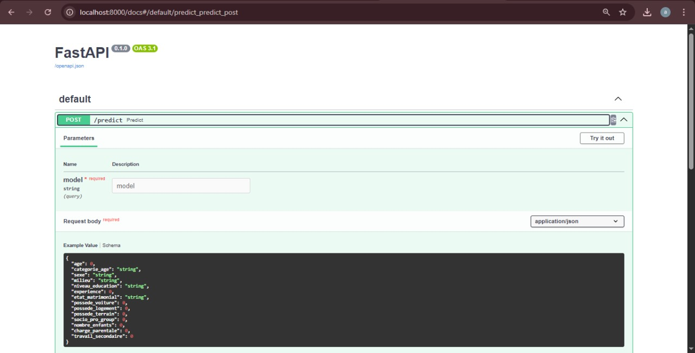
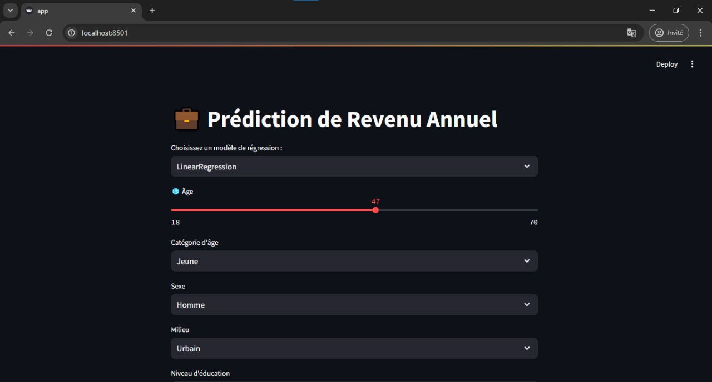

# 💼 AI Mini-Project – Annual Income Prediction

This AI mini-project aims to **predict the annual income of Moroccan citizens** based on simulated socio-economic data.

---

## 📓 Notebook

The file `mini_projet_AI_LAMRANI_YOUSSEF_FAILALI_JATABI_HAYTHAM.ipynb` contains the entire development process:

* Dataset generation (`dataset_revenu_marocains.csv`) using simulated data
* Data cleaning, transformation, and normalization
* Construction of preprocessing pipelines
* Training of regression models
* Saving of the best-performing models (`.joblib` files)

## 📌 Features

* **FastAPI** for model inference via API
* **Streamlit** for a fast and simple web interface
* 3 available regression models:

  * `LinearRegression`
  * `GradientBoostingRegressor`
  * `MLPRegressor`
* Simulated dataset with 40,000 entries
* Exploratory data analysis using **Sweetviz**

---

## 🚀 How to Use

### 1. Create and activate a virtual environment

```bash
python -m venv env
.\env\Scripts\activate
```

### 2. Install dependencies

```bash
pip install -r requirements.txt
```

### 3. Run the FastAPI backend

```bash
uvicorn api:app --reload
```

Access the API at: [http://localhost:8000/docs](http://localhost:8000/docs)



### 4. Launch the Streamlit web app

```bash
streamlit run app.py
```

---

## 🖼️ User Interface (Example)

Below are some screenshots of the Streamlit application:

### 🟦 Model selection and variable input:




